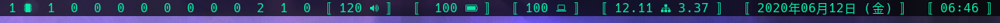

# My personal build of dwmblocks

<p align="center">
  
</p>

[Dwmblocks](https://github.com/torrinfail/dwmblocks) is a modular status bar for dwm written in C. This build is a fork of the original.

## Modifying blocks

The statusbar is made from text output from commandline programs. Blocks are added and removed by editing the `config.h` file.

## Scripts

I have dwmblocks read [my custom scripts](https://github.com/sarrost/scripts). For the build to work straight out of the, download my scripts and put them in your `$PATH`. 

## Installation

```bash
git clone https://github.com/sarrost/dwmblocks
cd dwmblocks/src
sudo make install
```

## Usage

```bash
dwmblocks
```
In [my build of dwm](https://github.com/sarrost/scripts) I have dwmblocks run everytime I start/restart dwm.

## Signaling changes

Most statusbars constantly rerun every script every several seconds to update.  This is an option here, but a superior choice is giving your module a signal that you can signal to it to update on a relevant event, rather than having it rerun idly.

For example, the volume module has the update signal 12 by default.  Thus, running `pkill -RTMIN+10 dwmblocks` will update it.

You can also run `kill -44 $(pidof dwmblocks)` which will have the same effect, but is faster (and sometimes unstable). Just add 34 to your typical signal number.

My volume module *never* updates on its own, instead I have this command run along side my volume shortcuts in dwm to only update it when relevant.

## Contact

* Herbert Magaya <herbert.magaya@protonmail.com>
